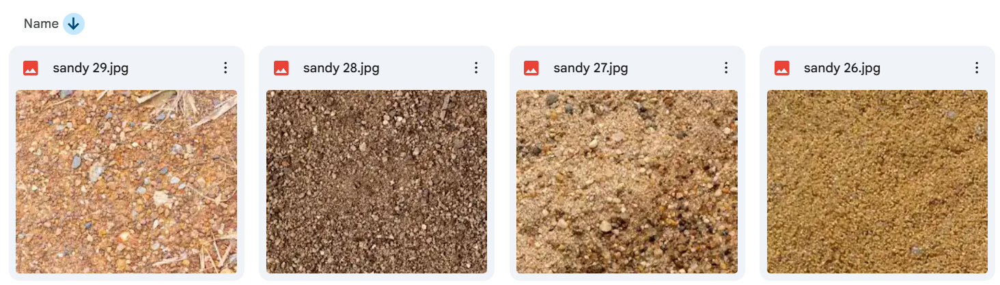
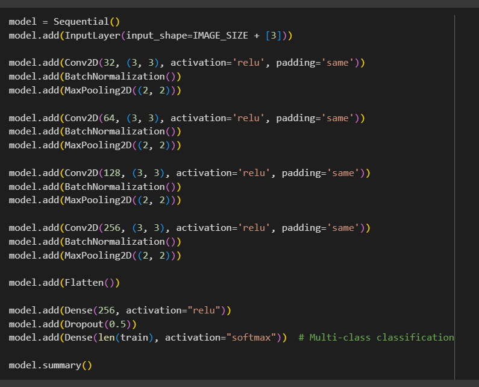
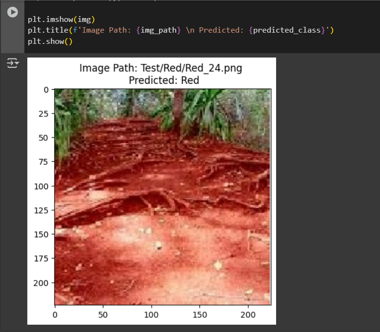
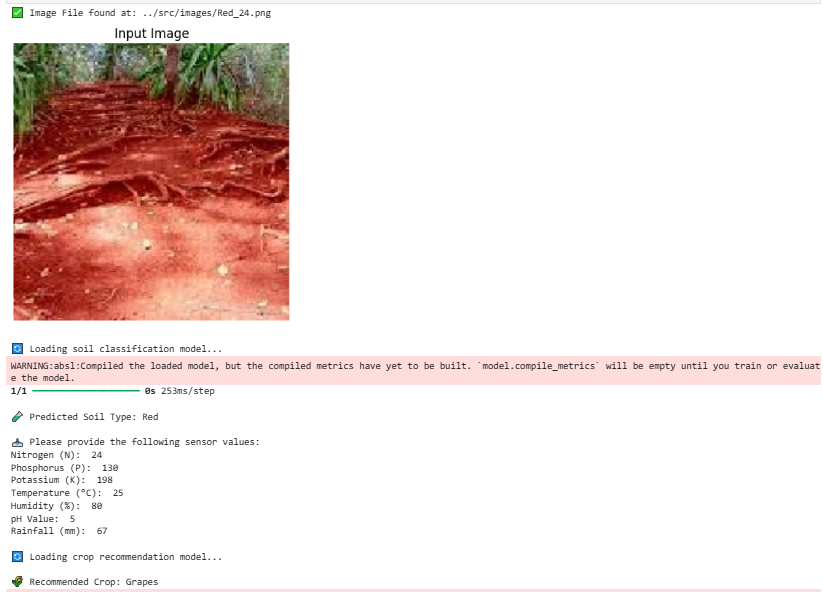

# <u>Autonomous Reforestation Robot: ML Model for Crop Recommendation</u>
### (PDE4433_CW2)
 

This project presents a machine learning system designed for integration with an Autonomous Reforestation Robot, capable of recommending optimal crops for arid and desert environments. The system leverages both image-based soil classification and sensor-driven tabular data to provide intelligent and sustainable crop suggestions.

By utilizing sensor-collected data, the model provides accurate predictions, thereby enhancing the precision of crop recommendations for sustainable agriculture.

**Folder Structure** 

- data/ : To store all the data that use for model training and testing
- models/ : For save all the models.
- notebooks/ : All Jupyter notebooks used for programming.
- src/: All the source data (Ex. images, videos) will save here.

## <u>Datasets Used</u>

1. **Soil Image Datasets**  
   - [Soil Types by Prasansha Satpathy](https://www.kaggle.com/datasets/prasanshasatpathy/soil-types)  
   - [Soil Types Dataset by J. H. Matchouath](https://www.kaggle.com/datasets/jhislainematchouath/soil-types-dataset)  

   

2. **Crop Recommendation Dataset**  
   - [Crop Recommendation by Varshita Nalluri](https://www.kaggle.com/datasets/varshitanalluri/crop-recommendation-dataset)  

   

## <u>Model Architecture</u>
The system employs a two-stage modeling approach where the first model analyzes soil texture images to classify soil type, while the second model integrates this output with additional sensor data to predict suitable crop types. This modular design ensures specialized processing for each data modality while maintaining interoperability between components.

In this stage ML model will analyse the sensor data including predicted data from first model, and then predict suitable crop type for the area. 
<a href="notebooks/PDE4433_CW2_FinalModelTraining.ipynb">(Model Analysis)</a> 

### 1. Soil Classification Model (CNN)
- Input: Soil texture images
- Output: Soil Type
- Accuracy:
  - Training: 90.36%
  - Test: 85.00%
- Model: [`soil_clasify_model_epc15.h5`](models/soilRecognizeModel/soil_clasify_model_epc15.h5)

### 2. Crop Recommendation Model
- Input: Sensor values + Soil Type (from Model 1)
- Algorithms:
  - Decision Tree:
    - Train Accuracy: 95.39%
    - Test Accuracy: 95.00%
    - Model: [`Crop_RecommendationDT_decision_tree_model.pkl`](models/Crop_RecommendationDT_decision_tree_model.pkl)
  - Random Forest:
    - Train Accuracy: 99.35%
    - Test Accuracy: 99.24%
    - Model: [`Crop_RecommendationDT_random_forest_model.pkl`](models/Crop_RecommendationDT_random_forest_model.pkl)

 

The soil prediction model was trained using Google Colab. Codes and test files can be see <a href="https://drive.google.com/drive/folders/1S1gEy1sYb-HPSGwDsGU8mo7gU-cSxGoU?usp=sharing">here</a>.

<u>Soil types:</u>

<u>Soil recognition model:</u>

<u>Soil texture prediction:</u>

Due to its superior accuracy, the **Random Forest Model** was selected for further robotics development.

## <u>Final Crop Prediction Model Combined with Image Prediction</u>
With both models reaching a satisfactory level of performance, they were integrated to function as a unified system. In the final implementation, the combined model operates in the following manner: images are used as inputs to predict the soil texture, while tabular data — including various sensor readings — serves as additional input for the crop recommendation process. This hybrid approach leverages the strengths of both image classification and tabular data analysis to provide more accurate and context-aware crop predictions.

<u>Combined models and final outcome:</u>

## <u>Challenges Faced</u>

1. **Finding Relevant Datasets**  
   Desert-specific datasets with rich vegetation were scarce. Thus, commonly available soil and crop datasets were adapted.

2. **Preventing Overfitting**  
   Decision Tree and Random Forest models required tuning and early stopping to avoid overfitting on tabular categorical data.

---

## <u>Future Enhancements</u>

1. Expand datasets to include desert-specific and regionally diverse data.
2. Integrate deep learning techniques (e.g., Transformers, CNN-RNN hybrids).
3. Enable online learning for continuous updates.
4. Support real-time sensor-based automation in robots.
5. Include GPS, LiDAR, and sensor fusion for autonomous navigation.
6. Use GIS, drone, and satellite data for large-scale prediction.
7. Integrate IoT/cloud for real-time, remote operation.
8. Develop solar-powered hardware for sustainability.

  

---
🧑‍💻 *Developed by Jayashanka Anushan*  
📧 Email: [jayasankaanushan199@gmail.com](mailto:jayasankaanushan199@gmail.com)  
🌐 [Portfolio](https://sites.google.com/view/jayashanka-anushan/home) | [LinkedIn](https://linkedin.com/in/JayashankaAnushan) | [GitHub](https://github.com/JayashankaAnushan)
