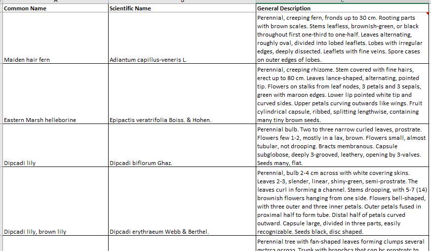
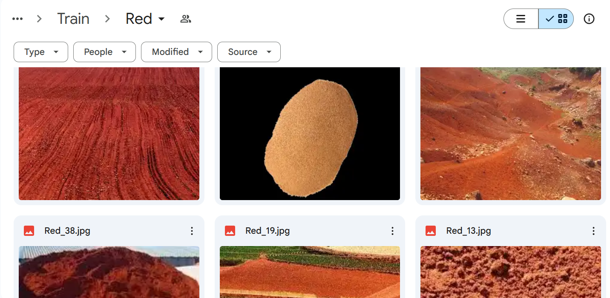
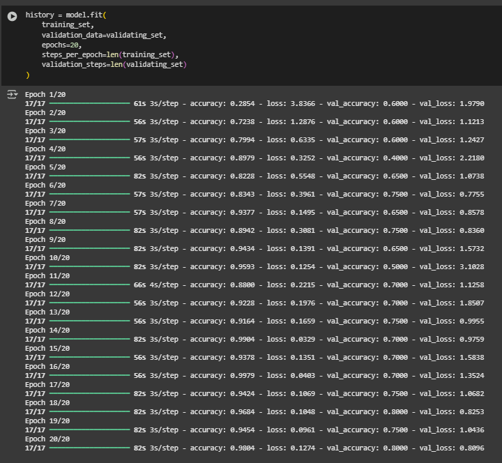
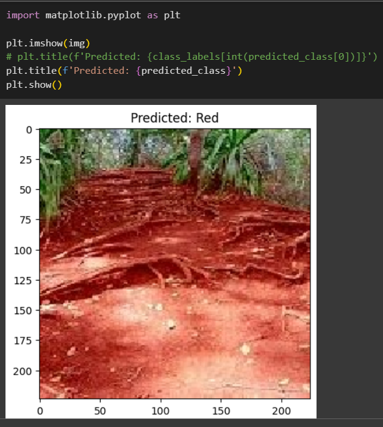

# <u>Autonomous Reforestation Robot (ML Model) for PDE4433_CW2</u>

This project develops a machine learning model to predict suitable crops for desert environments, designed for integration with an Autonomous Reforestation Robot. The model processes sensor data (soil moisture, humidity, nitrogen, potassium, phosphorus levels, and soil texture images) to determine the best crop type.

It utilizes image processing with a pre-trained VGG16 model and a supervised learning approach for accurate predictions, enhancing precision in crop recommendations for sustainable agriculture.

1. data/ : For save all the data that use for model training and testing
2. models/ : For save all the models.
3. notebooks/ : All the jupiter notbooks that use to programing.
4. src/: All the source data (Ex. images, videos) will save here.

## Data sets
For the model training, I have used below datasets.
1. Below datasets taken from Kaggle.
- https://www.kaggle.com/datasets/matshidiso/soil-types - contain images of soil type (144 Images)
- https://www.kaggle.com/datasets/jhislainematchouath/soil-types - contain images of soil type (1555 Images)
- https://www.kaggle.com/datasets/kurniaaisyah/soil-types-dataset - contain images of soil type (881 Images)
- https://www.kaggle.com/datasets/thirishag/soil-types - contain images of soil type (1360 Images)

2. Dataset received from Environment Agency – Abu Dhabi.
Plants_from_ead.xlsx - Via Email

<!--  -->

## Models
For the projects there will be two stages of process and each stages will have two different models that predict different types of data and fisr model prediction will be use as a input for the second model.

### 1. First Stage - Image analyse
In this stage ML model will analyse the image and predict soil type. Collected datasources categorized according to the dataset that i finalized to train the crop prediction model. Due to the high performence reuqirement for the image training, i used google co-lab for this. All the files and coding in below;

https://drive.google.com/drive/folders/1S1gEy1sYb-HPSGwDsGU8mo7gU-cSxGoU?usp=sharing

Below is the soil texture types; 
(Sandy, Red, Loamy, Clayey, Black)

Sample snapshot from soil images for training;

Model training; <b>Reached 80% of Validation accuracy</b>

Prediction of soil texture;

Trained model (<a href="https://drive.google.com/drive/folders/1UNrYN5fDYWGXo-kDnih-RNrm11J13Enl?usp=sharing">h5 file</a>) can be access via below link;
https://drive.google.com/drive/folders/1UNrYN5fDYWGXo-kDnih-RNrm11J13Enl?usp=sharing

### 2. Second stage - Sensor data analyse
In this stage ML model will analyse the sensor data including predicted data from first model, and then predict suitable crop type for the area. 
<a href="notebooks/PDE4433_CW2_FinalModelTraining.ipynb">Second Analysis</a>

Most accurate model so far: <a href="models/decision_tree_model.pkl">decision_Tree</a>

## Extra effert to improve model accuracy
1. Tried with GAN to improve the dataset 
<a href="notebooks/Use_GAN_toImproveDataset.ipynb">GAN Test</a>
2. Test the dataset received from EAD
<a href="notebooks/newDataSetTesting_FromEAD.ipynb.ipynb">EAD Dataset Test</a>
3. Tried with ChatGPT and XGBosterClasifier for increase accuracy
<a href="notebooks/ReSampling_for_Increase_Accuracy.ipynb">Resampling Test</a>

## Challenges
### 1. Find datasets
- Given that the conducted research and studies have specialized purposes, locating an appropriate dataset proved to be challenging. For the initial model, I was able to gather over 1000 images. However, when categorizing the images, I found that there were insufficient samples to create a balanced dataset. As a result, I had to work with a limited number of images, which required running 20 cycles of model training to achieve reasonable results.
### 2. Analyse and match the datasets for both stages
- The first and second models are interconnected, with the output of the first model (i.e., predicted "crop type") serving as an input for the second model. To ensure compatibility, I selected only a few soil textures that could be predicted within the scope of the second dataset to train the first model. This approach streamlined the prediction process but also posed challenges in aligning the datasets for optimal performance.

## Future enhancement
1. To obtain more accurate results, it is essential to utilize a more generalized dataset with a larger volume of samples for model training.
2. Integration with robotics can be achieved by directly feeding sensor outputs into the model, and utilizing the predicted crop types to drive the next stages of robotic development, such as autonomous planting robots, irrigation management robots, and other related systems.