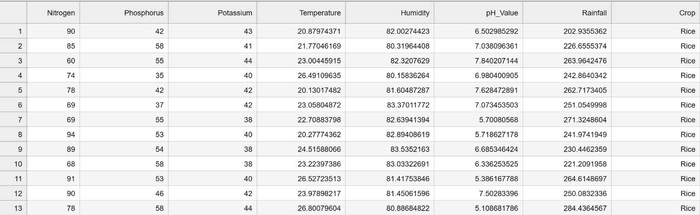

# <u>Autonomous Reforestation Robot (ML Model) for PDE4433_CW2</u>

This project develops a machine learning model aimed at predicting the most suitable crops for desert environments, designed for integration with an Autonomous Reforestation Robot. The model processes sensor data, including soil moisture, humidity, nitrogen, potassium, and phosphorus levels, to determine the optimal crop type.

By utilizing sensor-collected data, the model provides accurate predictions, thereby enhancing the precision of crop recommendations for sustainable agriculture.

**Folder Structure**

1. data/ : For save all the data that use for model training and testing
2. models/ : For save all the models.
3. notebooks/ : All the jupiter notbooks that use to programing.
4. src/: All the source data (Ex. images, videos) will save here.

## Data sets
For the model training, I have used below dataset.
1. Below datasets taken from Kaggle.
- https://www.kaggle.com/datasets/varshitanalluri/crop-recommendation-dataset

<b>Sample view of Dataset</b>

## Models
For the projects there will be two stages of process and each stages will have two different models that predict different types of data and fisr model prediction will be use as a input for the second model.

In this stage ML model will analyse the sensor data including predicted data from first model, and then predict suitable crop type for the area. 
<a href="notebooks/PDE4433_CW2_FinalModelTraining.ipynb">(Model Analysis)</a> 

Models and accuracy so far: 
1. <a href="models/Crop_RecommendationDT_decision_tree_model.pkl">Model trained by Decision Tree</a>
    - Train Accuracy: 95.39% 
    - Test Accuracy: 95.00%
2. <a href="models/Crop_RecommendationDT_random_forest_model.pkl">Model trained by Random Forest Model</a>
    - Train Accuracy: 95.58%
    - Test Accuracy: 93.94%

Since the highest accuracy, Decison Tree Model selected for further Robotics development.

## Challenges
### 1. Find datasets
- Due to the specialized nature of the conducted research and studies, identifying a suitable dataset proved to be a significant challenge. As the focus of this analysis is to examine desert areas with abundant tree coverage, finding a relevant dataset specific to this domain was particularly difficult. As a result, commonly used datasets for model training were considered as alternative options

### 2. Avoid overfitting and increase predict accuracy
- The dataset used for model training is a tabular dataset, with the target output being of a categorical data type. For model training, Decision Tree and Random Forest algorithms were employed. To mitigate the risk of overfitting and enhance prediction accuracy, training was halted at an optimal point, with extensive fine-tuning applied to achieve the best model performance.

## Future enhancement
1. To obtain more accurate results, it is essential to utilize a more generalized dataset with a larger volume of samples for model training.
2. Integration with robotics can be achieved by directly feeding sensor outputs into the model, and utilizing the predicted crop types to drive the next stages of robotic development, such as autonomous planting robots, irrigation management robots, and other related systems.