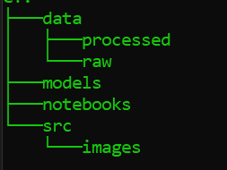

# Autonomous Reforestation Robot (ML Model) for PDE4433_CW2

This project develops a machine learning model to predict suitable crops for desert environments, designed for integration with an Autonomous Reforestation Robot. The model processes sensor data (soil moisture, humidity, nitrogen, potassium, phosphorus levels, and soil images) to determine the best crop type.

It utilizes image processing with a pre-trained VGG16 model and a supervised learning approach for accurate predictions, enhancing precision in crop recommendations for sustainable agriculture.

1. data/ : For save all the data that use for model training and testing
2. models/ : For save all the models.
3. notebooks/ : All the jupiter notbooks that use to programing.
4. src/: All the source data like images will save here.

## Data sets
For the model training, I have used below datasets.
1. Below datasets taken from Kaggle.
- https://www.kaggle.com/datasets/matshidiso/soil-types - contain images of soil type (144 Images)
- https://www.kaggle.com/datasets/jhislainematchouath/soil-types - contain images of soil type (1555 Images)
- https://www.kaggle.com/datasets/kurniaaisyah/soil-types-dataset - contain images of soil type (881 Images)
- https://www.kaggle.com/datasets/thirishag/soil-types - contain images of soil type (1360 Images)

## Models
For the projects there will be two stages of process and each stages will have two different models that predict different types of data and fisr model prediction will be use as a input for the second model.

### 1. First Stage - Image analyse
In this stage ML model will analyse the image and predict soil type.

### 2. Second stage - Sensor data analyse
In this stage ML model will analyse the sensor data including predicted data from first model, and then predict suitable crop type for the area.

